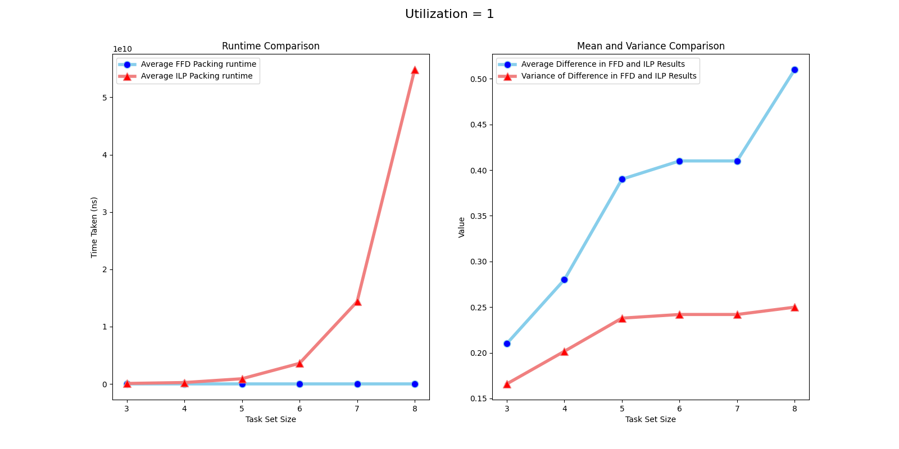
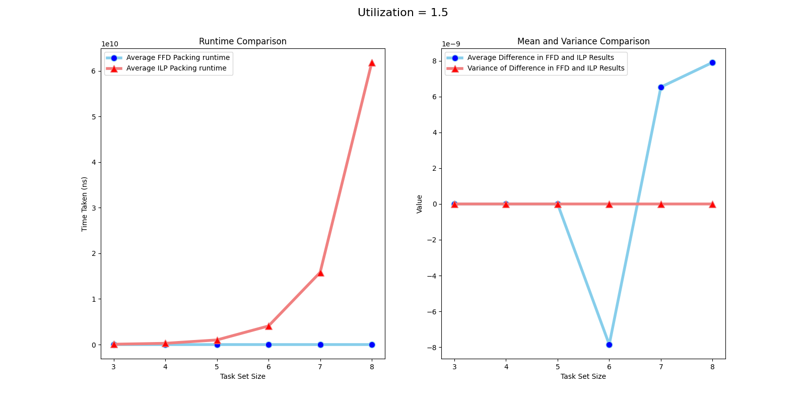
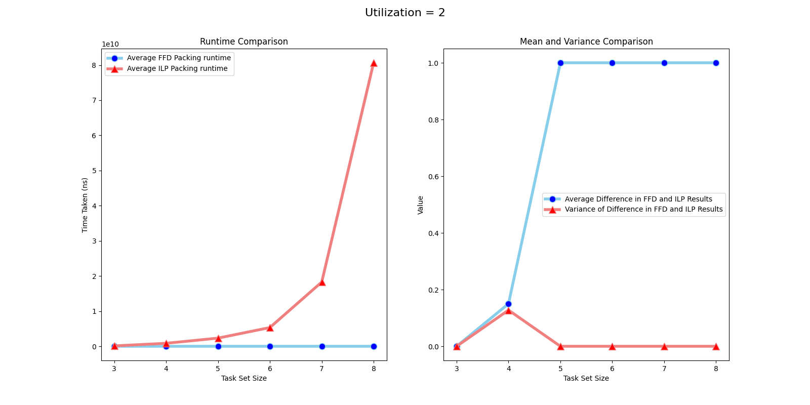
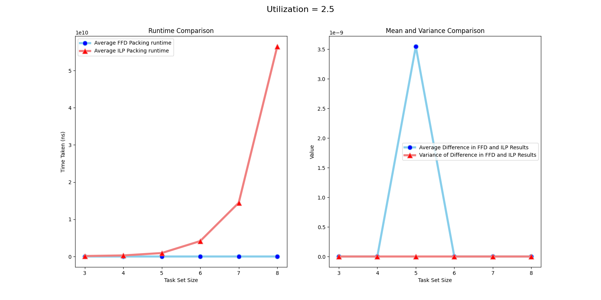
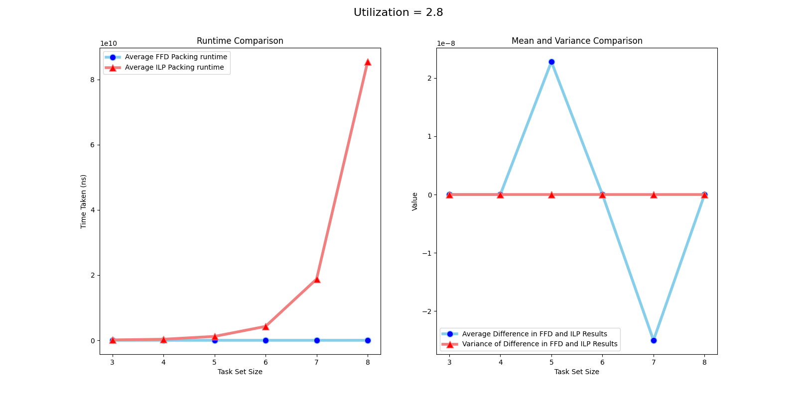
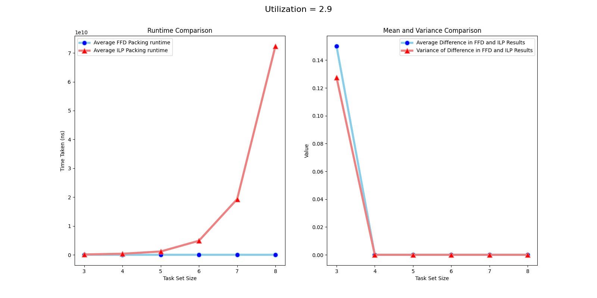
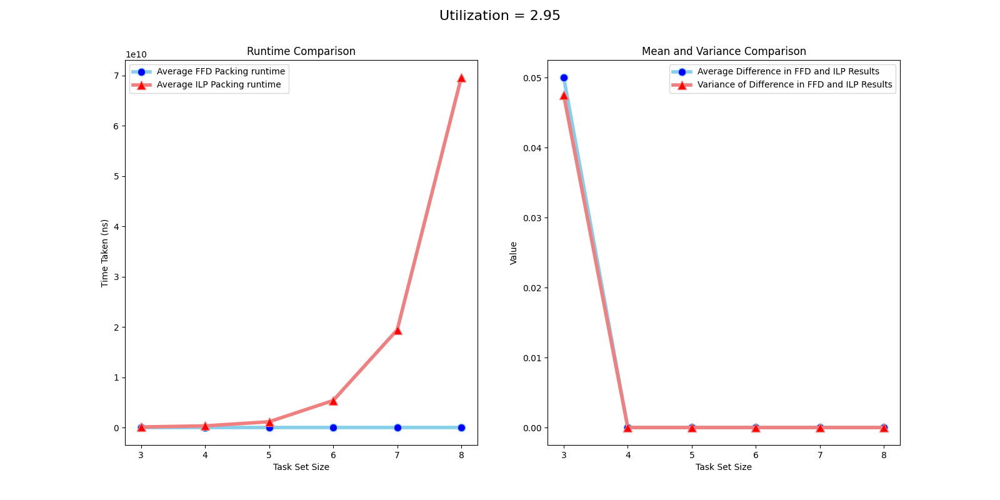
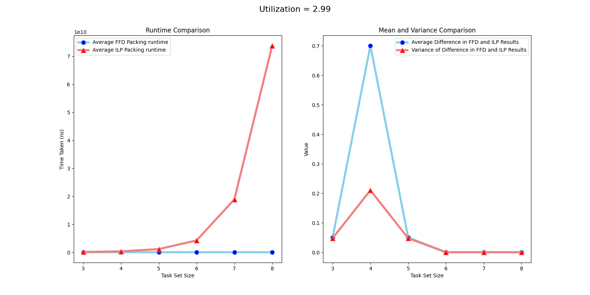

# Partitioning Heuristic Comparison

## Integer Linear Programming

### Definitions

Let $n$ be the number of tasks in the task set that we are trying to partition.

Let $m$ be the upper bound on the number of processors that we can try to schedule the tasks into.

Let $x$ be a $n$ x $m$ matrix of binary decision variables (each $x_{i,j}$).

Let $p$ be a 1 x $m$ matrix of binary variables that indicate if the processor at each index has been used.

### Objective

We want to get the (optimal) minimum number of processors used. Thus our objective function is:

minimize: $\sum_{k=1}^{m} p_k$

### Constraints

Since we want each task to be assigned exactly once in our final result we have the following:

$\sum_{j=1}^{m} x_{i,j} = 1$, for each $i \in \{1, \cdots, n\}$

We want the utilization of each processor to be $\leq 1$.

$\sum_{i=1}^{n} u_i\cdot x_{i, j} \leq 1$, for each $j \in \{1, \cdots, m\}$

## First Fit Decreasing Heuristic

We open and fill processors with tasks in order of decreasing utilization in an ordered list of opened processors.

## Methodology for Comparison

Implemented the RandFixedSum algorithm in Python to generate uniformly random multiprocessor task sets. Based closely on the MATLAB implementation provided by authors of the algorithm.

We have two lists:

- a list of target utilizations for our task sets. This will let us see if the utilization value has any effect on differences in the performance of FFD and ILP methods.
- a list of task set sizes that are generated for each utilization value. This will let us see differences on FFD and ILP performance depending on the task set size. Each item is a power of two

For each utilization value and task set size pair, we generate 100 task sets and let the FFD and ILP programs run on each.

The runtime for the packing of each task set by FFD and ILP is recorded along with the difference in the minimum number of processors each approach produces. This is averaged over the 100 task sets for each task set size.

Then for each utilization level, two plots are produced:

- Time taken by ILP and FFD for different task set sizes.
- Value of the means and variances of the differences in ILP and FFD results for different task set sizes

In both cases, the x axis the the $\log_{2}$(task set size).

The graphs for all utilization values are produced below:

